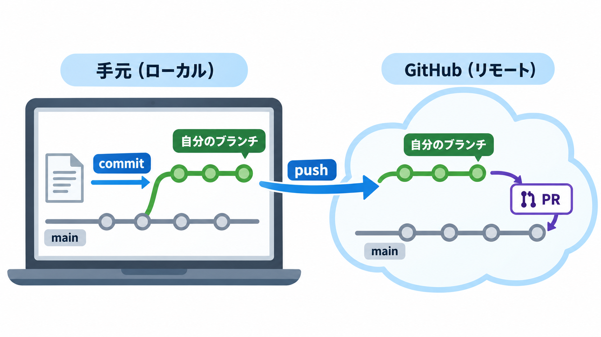

# 図で見るGitとGitHub

Gitを初めて使うと、手元のファイルを保存した時点、コミットした時点、GitHubへpushした時点の違いが見えにくくなります。このページでは、変更がどこにあるかを順番に追います。コマンドの操作手順は[README](../README.md#1-リポジトリを手元に用意する)にあります。

## Gitは何のために使うのか

たとえばページを直すたびに`index-final.html`、`index-final2.html`とファイルを増やすと、どれを使うべきか分かりにくくなります。Gitなら、同じ`index.html`を編集しながら、必要な時点の変更をコミットとして記録できます。後から「どの時点で、何を変えたか」を調べられます。履歴を使って以前の内容に戻す方法もありますが、この勉強会の必須課題では扱いません。

Gitは手元でも動く、変更履歴を管理する道具です。GitHubは、その履歴をインターネット上で共有し、PRやCIを使うサービスです。GitHubの画面を開かなくても手元でコミットできます。ただし、手元のコミットをほかの人に見せるにはpushが必要です。

## 全体の流れ

図の左は自分のパソコン（ローカル）、右はGitHub（リモート）です。今回の作業は次の順番です。

| 場所 | 何があるか | 対応する操作 |
| --- | --- | --- |
| 作業中のファイル | エディタで保存した`index.html` | 編集、`git diff`で確認 |
| ステージ | 次のコミットに入れると選んだ変更 | `git add`、`git diff --staged`で確認 |
| 手元のリポジトリ | コミットとして記録した履歴 | `git commit`、`git log`で確認 |
| GitHub上の自分のブランチ | push済みのコミット | `git push` |
| GitHub上の`main` | 共有する基準の履歴 | PRで取り込みを提案 |

リポジトリはファイルと変更履歴を管理する場所です。`git clone`でGitHubのリポジトリを手元にコピーすると、手元にもリポジトリができます。cloneは取得元を`origin`という名前で登録します。そのため、今回は自分で`git init`や`git remote add`を実行しません。

手元でファイルを保存しても、GitHub上のファイルは変わりません。コミットしても、その履歴はまだ手元だけにあります。pushして初めて、GitHub上の自分のブランチに同じコミットが届きます。

## ブランチは何を分けるのか

ブランチは、履歴のある時点を指す名前です。あるコミットから`main`と`workshop/hanako`に分かれた後、それぞれで別のコミットを記録できます。別のフォルダを毎回作る機能ではありません。`git switch -c workshop/hanako`は、手元にブランチを作り、そのブランチへ切り替える操作です。`-c`を付けない`git switch workshop/hanako`は、すでにあるブランチへ切り替えます。

全員が同じ`index.html`を編集しても、各自が自分のブランチにコミットすれば、共有用の`main`へすぐに変更は入りません。`git branch --show-current`で、今どのブランチにいるかを確認できます。`git push -u origin workshop/hanako`で初めて、GitHub側にもその名前のブランチが作られます。手元のブランチとGitHub上の同名ブランチは別々に存在するため、新しいコミットを作ったら再びpushします。

`main`も手元とGitHubにそれぞれあります。ほかの人がGitHub上の`main`を更新しても、自分の手元の`main`は自動では更新されません。今回の課題ではclone直後に自分のブランチを作るので、`main`を更新する操作は不要です。

## `git status`の2文字を読む

`git status --short`は、どのファイルに未記録の変更があるかを短く表示します。ファイル名の前の2文字は、左がステージ、右が作業中のファイルの状態です。

| 表示例 | 今の状態 |
| --- | --- |
| ` M index.html` | ファイルを編集したが、まだステージに載せていない |
| `M  index.html` | 変更をステージに載せた |
| `?? practice-note.txt` | Gitがまだ追跡していない新しいファイル |
| 何も表示されない | 未記録の変更がない |

`git add index.html`は、現在の変更を次のコミットへ入れる候補としてステージに載せます。たとえば`index.html`と別のメモを編集していて、ページだけをコミットしたい場合は`git add index.html`を使います。`git add .`はほかのファイルも載せるため、この課題では使いません。

ステージに載せる前の差分は`git diff -- index.html`、載せた後の差分は`git diff --staged -- index.html`で読みます。差分の`-`は前の行、`+`は後の行です。`git diff`が空になっても、ステージに載せた内容が消えたわけではありません。`git commit`はステージの内容を記録し、コミットIDとメッセージを付けます。`git log --oneline`で履歴を短く確認できます。

## PRと`git pull`は別の操作

pushした後にGitHubで作るPRは、「自分のブランチの変更を`main`へ取り込んでください」という提案です。GitHubの「Files changed」には、そのPRで提案する差分が表示されます。実務では人が差分をレビューすることもありますが、この勉強会ではレビュー承認を完了条件にしません。CIが成功しても、PRを作っただけでは`main`は変わりません。誰かがマージすると、変更が`main`の履歴に取り込まれます。この勉強会の完了条件はCI成功までです。

`git pull`は、GitHubなどのリモートで進んだ履歴を手元へ取得し、今いるローカルブランチに反映するコマンドです。名前が似ていますが、PRを作る操作ではありません。動画ではマージ後の`main`を手元へ取り込む場面で使っています。今回の必須手順では、clone直後の`main`からブランチを作るため、`git pull`を実行する必要はありません。

PRで修正が必要になったら、同じブランチでファイルを直し、コミットしてpushします。GitHubは新しいコミットを既存のPRへ追加し、CIを再実行します。PR本文だけならGitHub上で編集できます。[READMEの手順](../README.md#6-ciの結果を確認し必要なら同じprを直す)に戻って確認してください。履歴と一時退避を手元で試したい人には[追加課題](advanced-git.md)があります。

## 参考動画

[GitとGitHubの入門講座](https://www.youtube.com/watch?v=WHwuNP4kalU)では、Gitの目的（2:38〜）、GitHubでの共有とレビュー（9:10〜）、作業ファイル・ステージ・リポジトリの関係（16:00〜）、ブランチからPRまでの流れ（28:09〜）を詳しく説明しています。動画は約59分あるため、勉強会中に通して見る必要はありません。疑問が残った箇所を後から見返す参考資料です。
